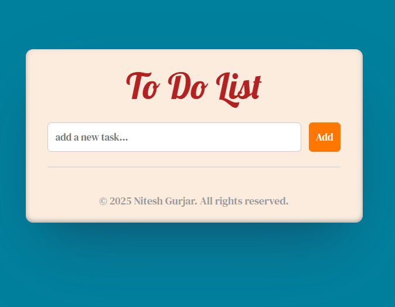

# 📝 To-Do List Web App

A simple and elegant To-Do List web application built with **HTML**, **CSS**, and **JavaScript**. It allows users to add, complete, and delete tasks with smooth animations and a mobile-responsive design.

---

## 🚀 Features

- ✅ Add new tasks
- ✔️ Mark tasks as completed (with strike-through effect)
- ❌ Delete individual tasks
- ✨ Smooth animations (fade-in, hover effects)
- 📱 Mobile responsive layout
- 🎨 Custom fonts and modern UI styling

---
## 📸 Screenshot

  

---

## 🌐 Live Demo

👉 [View Project on GitHub Pages](https://niteshgurjarr.github.io/to-do-list/)

---

## 🛠️ Technologies Used

- **HTML5**
- **CSS3**
- **JavaScript (Vanilla)**
  
---
© 2025 [Nitesh Gurjar](https://github.com/niteshgurjarr) – All rights reserved.
